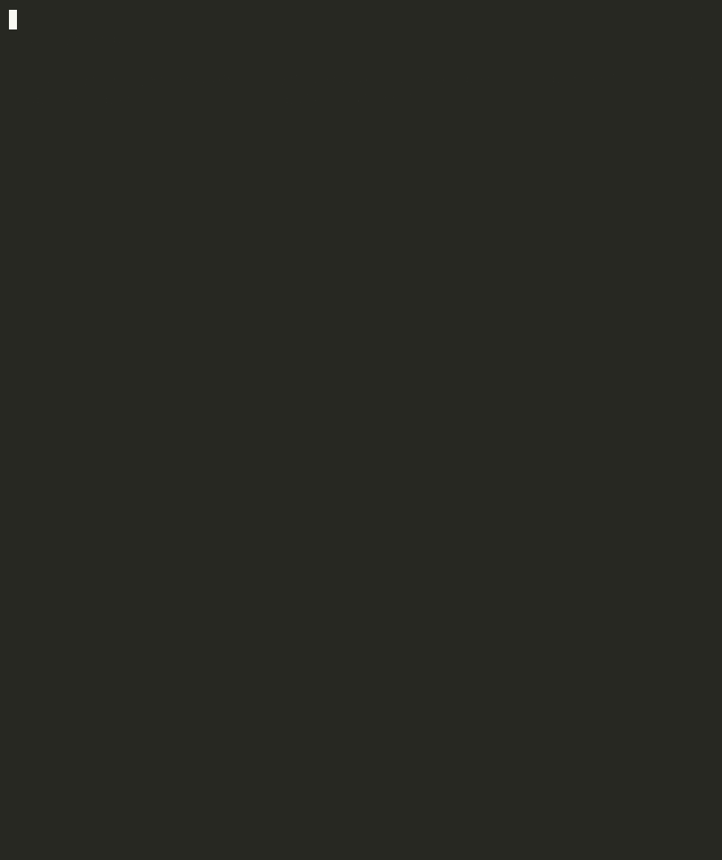

# xctriage


> From "xcodebuild failed" to root cause + fix in under a second.

Swift 6 command-line tool for AI-powered CI failure analysis on Apple platforms. Parses xcodebuild console output and `.xcresult` bundles. Rule-based classifier with Claude fallback via `URLSession`. Actor-based SQLite flaky test tracker with 90-day recurrence scoring.

Built to demonstrate what "passion for the CI user experience on Apple's platform" looks like in practice: native Swift, native tooling, native concurrency model.



---

## What it looks like in practice

```
$ xctriage analyze xcbuild.log --source xcodebuild --build-id ios27-5512

────────────────────────────────────────────────────────────
  xctriage
────────────────────────────────────────────────────────────
  ✗  COMPILATION ERROR
  build:  ios27-5512
  source: xcodebuild
  lines:  18
  time:   0ms

  CONFIDENCE
  ██████████████████░░ 92%

  ROOT CAUSE
  Swift/ObjC unresolved symbol or type error

  SUGGESTED FIX
  Check import statements and module visibility. Run
  `xcodebuild -showBuildSettings` to verify framework search paths.

  FAILURE SITES
  MediaDecoder.swift:142:17
    use of unresolved identifier 'AVAssetTrackSegment'
  MediaDecoder.swift:156:9
    cannot convert value of type 'CMTime' to specified type 'Double'
  AudioBufferProcessor.swift:89:22
    value of type 'AVAudioFormat' has no member 'channelCapacity'

  (analysis: rule-based)
────────────────────────────────────────────────────────────
```

Add `--llm` to fall back to Claude when rule confidence drops below 0.60:

```
$ export XCTRIAGE_ANTHROPIC_API_KEY=sk-ant-...
$ xctriage analyze xcbuild.log --source xcodebuild --llm
```

---

## Architecture

```
xcodebuild / xcresult bundle / CI log
            │
            ▼
┌─────────────────────────────────────────────────────────┐
│                        xctriage                         │
│                                                         │
│  ┌────────────────┐   ┌────────────────────────────┐    │
│  │  BuildLogParser│   │   XCResultParser (actor)   │    │
│  │  NSRegex rules │   │   xcrun xcresulttool wrap  │    │
│  │  Level detect  │   │   Codable JSON decode      │    │
│  └───────┬────────┘   └───────────┬────────────────┘    │
│          └──────────┬─────────────┘                     │
│                     ▼                                   │
│  ┌──────────────────────────────────────────────┐       │
│  │            RuleClassifier (struct)            │       │
│  │  17 NSRegularExpression rules                 │       │
│  │  7 categories · sub-millisecond · no network │       │
│  └───────────────────┬──────────────────────────┘       │
│                      │ confidence < 0.60 AND --llm       │
│                      ▼                                   │
│  ┌──────────────────────────────────────────────┐       │
│  │          ClaudeClassifier (actor)             │       │
│  │  URLSession POST to Claude API               │       │
│  │  Ephemeral prompt cache · Codable response   │       │
│  └───────────────────┬──────────────────────────┘       │
│                      │                                   │
│                      ▼                                   │
│  ┌──────────────────────────────────────────────┐       │
│  │         FlakyTestTracker (actor)              │       │
│  │  SQLite WAL · 90-day window                  │       │
│  │  score > 0.70 → quarantine candidate         │       │
│  └───────────────────┬──────────────────────────┘       │
│                      │                                   │
│          ┌───────────┴──────────────┐                   │
│          ▼           ▼              ▼                    │
│     Terminal        JSON           Slack                 │
│     (ANSI)       (Codable)      (URLSession)             │
└─────────────────────────────────────────────────────────┘
```

---

## CI Sources

| Source | Flag | What it parses |
|---|---|---|
| xcodebuild | `--source xcodebuild` | `.swift`/`.m` file:line:col errors, XCTest case failures, linker errors, `** BUILD FAILED **` |
| xcresult bundle | `--input build.xcresult` | `xcrun xcresulttool` JSON: build errors, test failures |
| GitHub Actions | `--source github` | `##[error]` annotations, `::error file=` |
| Generic | `--source generic` | Rule-based fallback |

---

## Failure Categories

| Category | Patterns (17 total) | Apple CI example |
|---|---|---|
| `compilation_error` | unresolved identifier, type mismatch, linker, code sign | `use of unresolved identifier 'AVAssetTrackSegment'` |
| `test_failure` | XCTest case failed, XCTAssert failure, `** TEST FAILED **` | `Test Case '-[MediaTests testBitIdentical]' failed (2.3s)` |
| `flaky_test` | intermittent, async timeout, connection-in-test | `async operation did not complete within 2 seconds` |
| `resource_exhaustion` | OOM, Killed:9, disk full, DerivedData | `No space left on device`, memory pressure |
| `infra_failure` | xcode-select error, simctl boot timeout, git LFS | `simctl boot failed: timeout` |
| `dependency_failure` | SPM resolve failed, CocoaPods error | `swift package resolve failed: package not found` |
| `timeout` | build timeout, signal KILL | `Build timed out after 3600 seconds` |

---

## Swift 6 Concepts Demonstrated

Rather than a feature checklist, here is how each concept appears in the actual code:

**`actor` for concurrent state**
- `ClaudeClassifier`: actor protects concurrent URLSession calls; no data races possible on API key / model config
- `XCResultParser`: actor wraps `Process` subprocess execution; multiple callers can't interleave xcresulttool spawns
- `FlakyTestTracker`: actor serializes all SQLite reads/writes; replaces NSLock or DispatchQueue

**`async/await` with `withCheckedThrowingContinuation`**
- `XCResultParser.run()`: converts `Process.terminationHandler` callback to async; no nested completion handlers
- `ClaudeClassifier.post()`: `URLSession.data(for:)` is async; entire network path is await-able

**Typed `throws` / custom `Error` enum**
- `TriageError: Error, Sendable`: all failure modes are named cases: `.xcresultToolFailed(Int32, String)`, `.claudeAPIError(Int, String)`, `.fileNotFound(String)`, `.parseError(String)`

**`Sendable` throughout**
- All model types are `Sendable` value types (`struct`, `enum`)
- `DBHandle: @unchecked Sendable`: wraps `OpaquePointer` so actor `deinit` can close SQLite without violation

**`Codable` for xcresult JSON**
- `XCResultSummary`, `XCResultAction`, `XCResultIssueSummary`: decode `xcresulttool` output with custom `CodingKeys` for Apple's `_value` nested structure

**`NSRegularExpression` at module level**
- All 17 patterns compiled once in `BuildLogParser` static constants: avoids per-call recompilation across every build log line

**`CommandConfiguration` + `AsyncParsableCommand`**
- `swift-argument-parser` integration for `analyze` and `flaky` subcommands with typed flags and options

---

## Jenkinsfile

The included `Jenkinsfile` runs xctriage on its own build output: self-triaging CI pipeline:

```groovy
stage('Build') {
    steps {
        sh 'swift build -c release 2>&1 | tee build.log'
    }
    post {
        failure {
            sh '''
                .build/release/xctriage analyze build.log \\
                    --source xcodebuild \\
                    --build-id "${BUILD_TAG}" \\
                    --llm \\
                    --output slack
            '''
        }
    }
}
```

---

## Install

### Download binary (macOS)

Download the latest `xctriage` binary from [Releases](https://github.com/gerardrecinto/xctriage/releases):

```bash
curl -L https://github.com/gerardrecinto/xctriage/releases/latest/download/xctriage -o xctriage
chmod +x xctriage
mv xctriage /usr/local/bin/xctriage
```

### Build from source

```bash
git clone https://github.com/gerardrecinto/xctriage.git
cd xctriage
swift build -c release
cp .build/release/xctriage /usr/local/bin/
```

---

## Usage

```bash
# Analyze xcodebuild log
xctriage analyze xcbuild.log --source xcodebuild

# Analyze xcresult bundle
xctriage analyze build.xcresult

# Read from stdin (pipe from xcodebuild)
xcodebuild test -scheme MyApp 2>&1 | tee build.log | xctriage analyze - --source xcodebuild

# Claude fallback when confidence < 0.60
export XCTRIAGE_ANTHROPIC_API_KEY=sk-ant-...
xctriage analyze xcbuild.log --source xcodebuild --llm

# Always use Claude
xctriage analyze xcbuild.log --source xcodebuild --llm-always

# JSON output (pipe to jq, Jira, etc.)
xctriage analyze xcbuild.log --source xcodebuild --output json | jq .classification

# Post to Slack
xctriage analyze xcbuild.log --source xcodebuild \
  --output slack --slack-webhook https://hooks.slack.com/...

# Show top flaky tests
xctriage flaky --n 20

# Exit with code 1 on failure: use in CI pipelines to gate merges
xctriage analyze xcbuild.log --source xcodebuild --exit-code
```

### CI gate mode with `--exit-code`

`--exit-code` returns exit code 1 when a failure is detected. Use it to block a pipeline stage on a real build failure:

```bash
# In a Jenkinsfile post-build step
xctriage analyze build.log --source xcodebuild --exit-code

# In a GitHub Actions step
- run: xctriage analyze build.log --source xcodebuild --exit-code
```

---

## Tests

```bash
swift test                          # 22 tests
swift test --enable-code-coverage   # with coverage
swift build -c release              # build binary
bash scripts/make_demo.sh           # run demo fixtures
```
